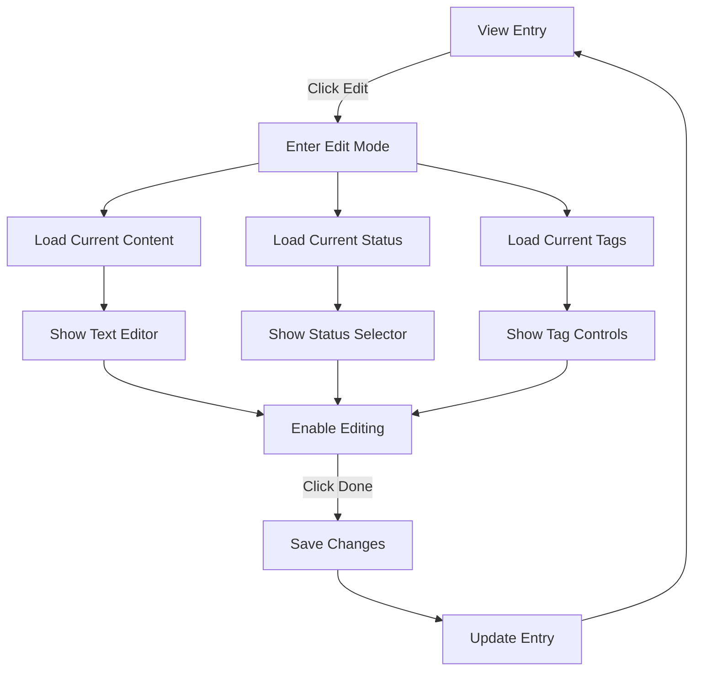
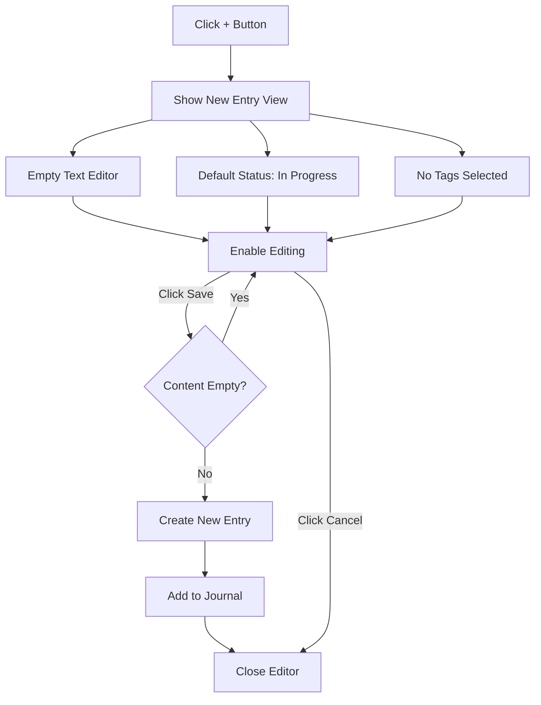
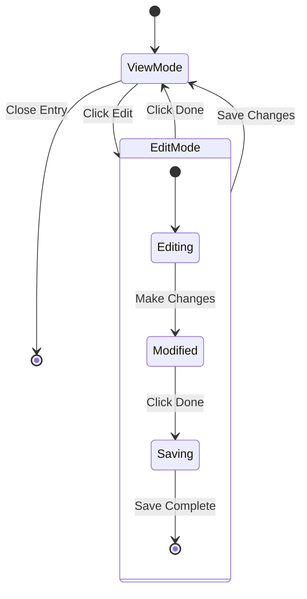
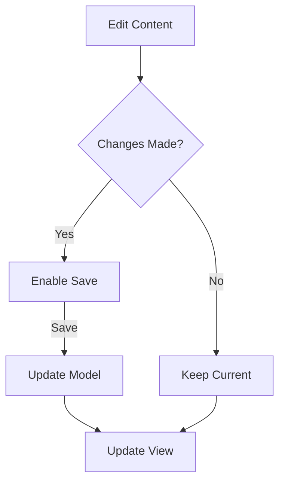
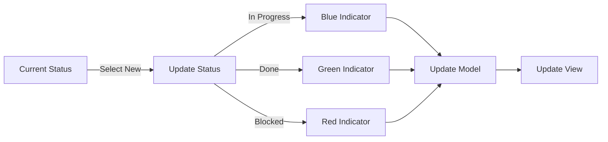
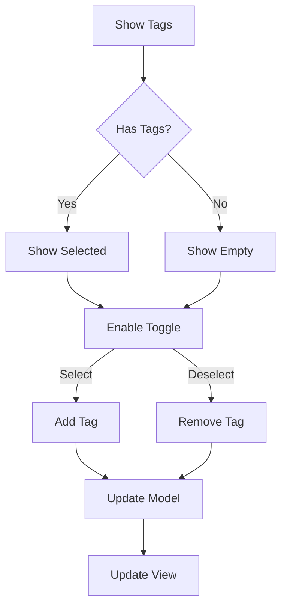
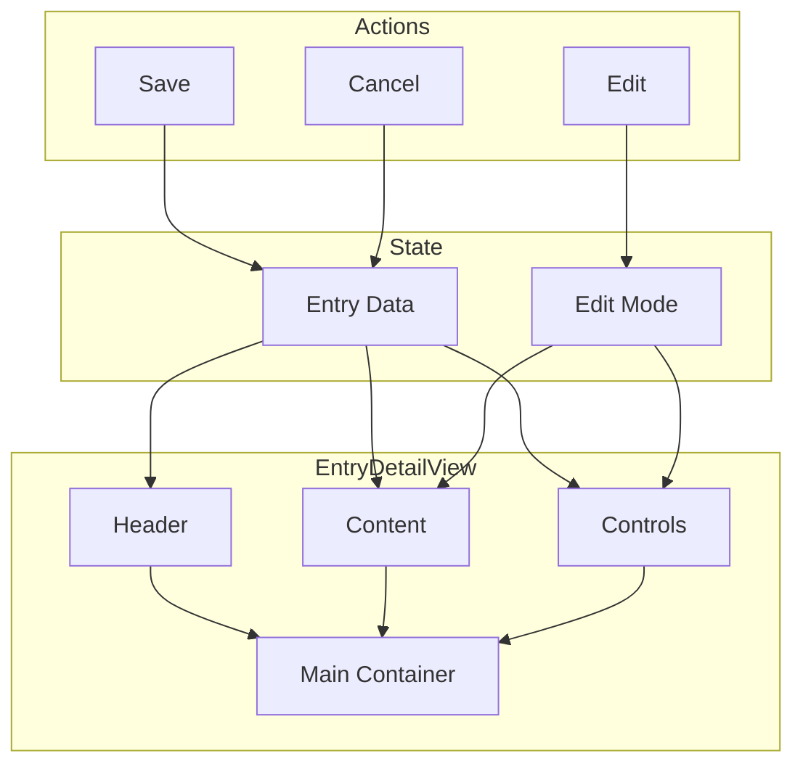

# Entry Detail View Flow

## View Mode to Edit Mode Flow

## New Entry Flow

## Entry State Changes

## Content Update Flow

## Status Change Flow

## Tag Management Flow

## Component Interaction

